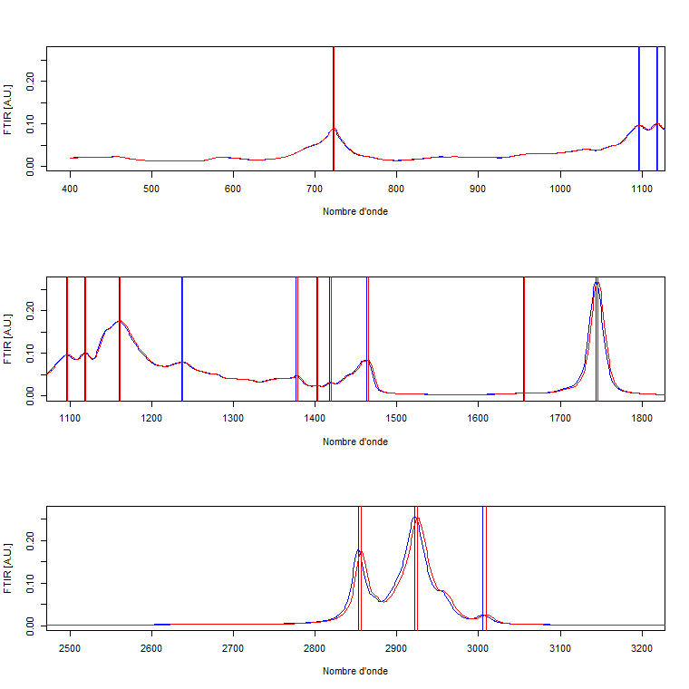
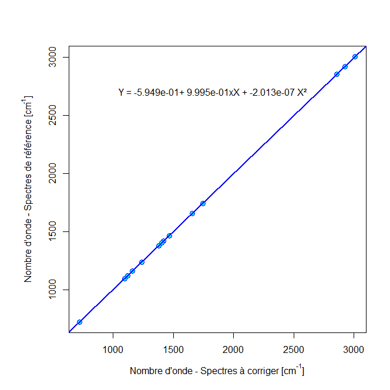
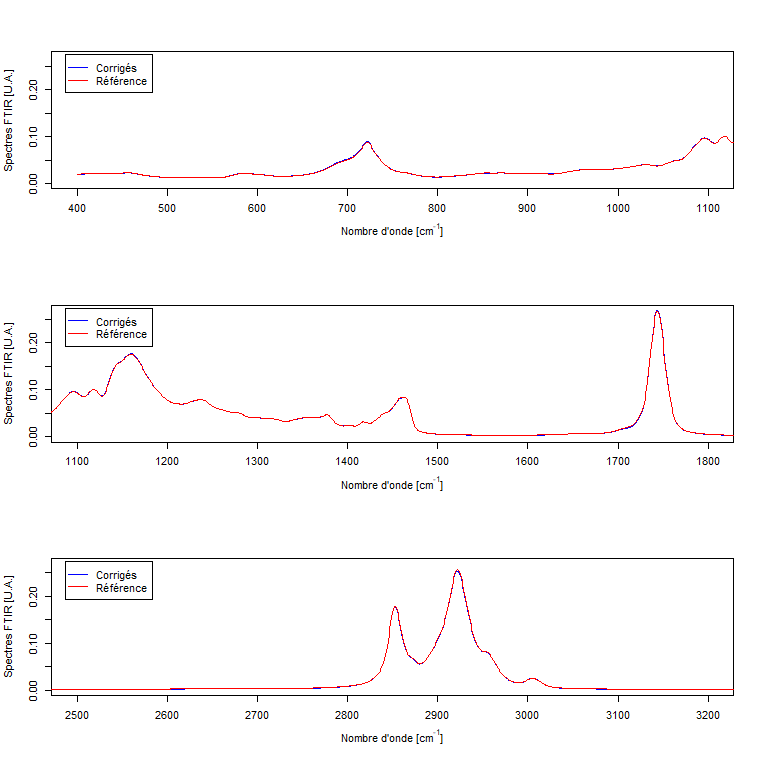

# Introduction

Ce rapport explique la procédure pour corriger des spectres FTIR lorsqu'il apparaît un décalage des spectres suivant l'axe des nombres d'ondes. La procédure est illustrée à partir d'un exemple.

# Données

Les données nécessaires sont deux fichiers de spectres FTIR tels que constitués par la fonction *FTIR_Assembler.R*. Cette procédure prend tous les fichiers brutes d'un répertoire de données et fait l'assemblage dans un fichier de spectres compatible avec *ShInSpectoR*. La procédure crée aussi un fichier des Y.

Les deux fichiers FTIR doivent avoir le même axe des X. L'un sert de référence et l'autre contient les spectres dont il faut corriger l'axe des X.

Dans notre exemple, les spectres de référence et les spectres à corriger sont dans un même fichier. On a utilisé la première composante principales pour séparer les 2 groupes de spectres et on a créé les fichiers nécessaires à la procédure. Normalement cette étape n'est pas requise.

```{r Fig_PC1, echo=TRUE, fig.caption = "Histogram des scores sur PC1 - Les données de référence correspondent aux valeurs élevées" }
#Sur PC1, les données plus récentes sont aux valeurs élevées (>10).
#On va utiliser ce critère pour séparer les 2 jeux de données.
ACPRes <- read.delim("~/Consultant/AAC_ACIA_2022_23/Data/FTIR_x_Shifts/ACPRes.txt")
hist(ACPRes$FTIR_PC1,20)
#PC1>10 : bonnes données
#PC1 <=10 : vieilles données

#Charge les données
#path <- utils::choose.dir()
path <- "D:\\Bernard\\Documents\\Consultant\\AAC_ACIA_2022_23\\Data\\FTIR_x_Shifts\\ShInSpec_data"
ftir <- read.table(file=file.path(path,'FTIR_forShInSpectoR.txt'),header=FALSE,sep="\t",dec=".",
           na.strings = "", stringsAsFactors = T)
Ys_df <- read.table(file=file.path(path,'Y_forShInSpectoR.txt'),header=TRUE,sep="\t",dec=".",
                   na.strings = "", stringsAsFactors = T)
echID <- as.character(ftir[,1])
wn <- as.numeric(ftir[1,-1])
sp <- ftir[-1,-1]
indi <- which(ACPRes$FTIR_PC1>10)
fGood <- sp[indi,]
fToCorrect <- sp[-indi,]

xRef <- rbind(wn,fGood)
xRef <- cbind(ID=c("",as.character(Ys_df[indi,1])),xRef)

write.table(xRef,file=file.path(path,"FTIR_RefforSInSpectoR.txt"),
                       col.names = F, row.names = F, dec=".", sep="\t")
write.table(Ys_df[indi,],file=file.path(path,"Y_RefforSInSpectoR.txt"),
                       col.names = T, row.names = F,  sep="\t")

xToCorrect <- rbind(wn,fToCorrect)
xToCorrect <- cbind(ID=c("",as.character(Ys_df[-indi,1])),xToCorrect)

write.table(xToCorrect,file=file.path(path,"FTIR_toCorrectforSInSpectoR.txt"),
            col.names = F, row.names = F, dec=".", sep="\t")
write.table(Ys_df[-indi,],file=file.path(path,"Y_toCorrectforSInSpectoR.txt"),
            col.names = T, row.names = F,  sep="\t")


```

# Sommaire de la procédure

La procédure est complètement prise en charge par la fonction *doFTIRShift.R*.

1.  L'opérateur choisi le fichier des spectres de référence et le fichier des spectres à corriger.

2.  Ensuite le programme fait toutes les opérations de façon automatique:

    1.  lit les données;

    2.  calcule un spectre moyen pour chaque jeu de spectres;

    3.  trouve les pics sur les 2 spectres moyens (*trouvePics.R*);

    4.  fait l'appariement de 2 séries de pics (*matchPics.R*);

    5.  calcul une régression pour recalculer les valeurs de l'axe des X pour les spectres à corriger et applique la correction (*shiftFTIR.R*);

    6.  crée un fichier de spectres corrigés. Le nom du fichier pour les spectres corrigés est le même que celui pour les spectres à corriger mais on ajoute la lettre "*c*" juste avant le premier "\_" du nom. Ainsi ce fichier demeure compatible avec le fichier des Y associé aux données à corriger.

# Exemple

Pour faire l'opération, il faut charger la fonction *doFTIRShift.R* avec la fonction R *source*. Ensuite, on appelle la fonction. Par exemple:

``` R
source(here::here("InSpectoR/doFTIRShift.R"), encoding = 'UTF-8', echo=TRUE)
doFTIRShift(top=15, tol=5, plotme=T)
```

Il y a trois paramètres à la fonction:

1.  top : donne le nombre de pics à conserver. Ce sont les pics les plus pointus qui sont conservés en se basant sur la valeur de la dérivée seconde.

2.  tol : donne la différence maximale en X pour que 2 pics appariés soient conservés. Si cette différence est supérieure à tol, le pic est rejeté.

3.  plotme : si TRUE (T), montre le résultat sous forme graphique. Si FALSE (F), s'exécute de façon silencieuse.

Trois graphiques sont générés. Dans la première, le décalage est illustré. Il est clair que le décallage augmente avec le nombre d'onde. On montre aussi la position des pics pour chacun des spectres.

{#Figure 1}

La figure suivante montre la régression qui sert à corriger les nombres d'ondes. On voit que la relation est très linèaire avec un léger décalage à l'origine et une pente légèrement inférieure à 1 ce qui est compatible avec les observations faites à la figure précédente.



Finalement, la dernière figure montre le résultat de la correction.


